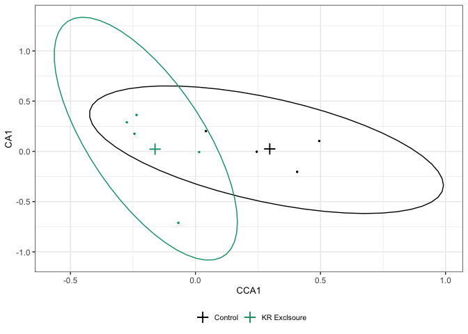

Plants by Treatment
================
Ellen Bledsoe
10/21/2020

## Annuals by Sampling Period and Treatment

Running CCA (from Supp et al., 2012 and Portal-LTREB) to see if there
are significant differences in plant communities between controls and KR
exclosures for each season of diet
sampling.

### Summer Annuals 2016

<!-- -->

    ## [1] "Variance Inflation Factor (<10 is fine)"

    ## summerannuals_2016_trtexclosure 
    ##                               1

    ## [1] "Variance explained:"

    ## [1] 0.1117901

    ## Permutation test for cca under NA model
    ## Marginal effects of terms
    ## Permutation: free
    ## Number of permutations: 999
    ## 
    ## Model: cca(formula = summerannuals_2016_sp ~ summerannuals_2016_trt)
    ##                        Df ChiSquare     F Pr(>F)
    ## summerannuals_2016_trt  1   0.05687 0.881  0.611
    ## Residual                7   0.45185

### Winter Annuals 2017

<!-- -->

    ## [1] "Variance Inflation Factor (<10 is fine)"

    ## winterannuals_2017_trtexclosure 
    ##                               1

    ## [1] "Variance explained:"

    ## [1] 0.1674206

    ## Permutation test for cca under NA model
    ## Marginal effects of terms
    ## Permutation: free
    ## Number of permutations: 999
    ## 
    ## Model: cca(formula = winterannuals_2017_sp ~ winterannuals_2017_trt)
    ##                        Df ChiSquare      F Pr(>F)  
    ## winterannuals_2017_trt  1   0.11540 1.4076  0.081 .
    ## Residual                7   0.57389                
    ## ---
    ## Signif. codes:  0 '***' 0.001 '**' 0.01 '*' 0.05 '.' 0.1 ' ' 1

### Summer Annuals 2017

<!-- -->

    ## [1] "Variance Inflation Factor (<10 is fine)"

    ## summerannuals_2017_trtexclosure 
    ##                               1

    ## [1] "Variance explained:"

    ## [1] 0.1090373

    ## Permutation test for cca under NA model
    ## Marginal effects of terms
    ## Permutation: free
    ## Number of permutations: 999
    ## 
    ## Model: cca(formula = summerannuals_2017_sp ~ summerannuals_2017_trt)
    ##                        Df ChiSquare      F Pr(>F)
    ## summerannuals_2017_trt  1   0.05155 0.8567  0.701
    ## Residual                7   0.42123

## All Plants by Sampling Period and Treatment

### Summer All Plants 2016

<!-- -->

    ## [1] "Variance Inflation Factor (<10 is fine)"

    ## summer_2016_trtexclosure 
    ##                        1

    ## [1] "Variance explained:"

    ## [1] 0.1326964

    ## Permutation test for cca under NA model
    ## Marginal effects of terms
    ## Permutation: free
    ## Number of permutations: 999
    ## 
    ## Model: cca(formula = summer_2016_sp ~ summer_2016_trt)
    ##                 Df ChiSquare     F Pr(>F)
    ## summer_2016_trt  1   0.10162 1.071  0.328
    ## Residual         7   0.66418

### Winter All Plants 2017

<!-- -->

    ## [1] "Variance Inflation Factor (<10 is fine)"

    ## winter_2017_trtexclosure 
    ##                        1

    ## [1] "Variance explained:"

    ## [1] 0.1477049

    ## Permutation test for cca under NA model
    ## Marginal effects of terms
    ## Permutation: free
    ## Number of permutations: 999
    ## 
    ## Model: cca(formula = winter_2017_sp ~ winter_2017_trt)
    ##                 Df ChiSquare      F Pr(>F)
    ## winter_2017_trt  1   0.14903 1.2131  0.146
    ## Residual         7   0.85992

### Summer All Plants 2017

<!-- -->

    ## [1] "Variance Inflation Factor (<10 is fine)"

    ## summer_2017_trtexclosure 
    ##                        1

    ## [1] "Variance explained:"

    ## [1] 0.1229296

    ## Permutation test for cca under NA model
    ## Marginal effects of terms
    ## Permutation: free
    ## Number of permutations: 999
    ## 
    ## Model: cca(formula = summer_2017_sp ~ summer_2017_trt)
    ##                 Df ChiSquare      F Pr(>F)
    ## summer_2017_trt  1   0.07275 0.9811  0.536
    ## Residual         7   0.51907
