Plants by Treatment
================
Ellen Bledsoe,
April 2021

## Annuals by Sampling Period and Treatment

Running CCA (from Supp et al., 2012 and Portal-LTREB) to see if there
are significant differences in plant communities between controls and KR
exclosures for each season of diet
sampling.

### Summer Annuals 2016

#### Bray-Curtis Distances & Heatmap

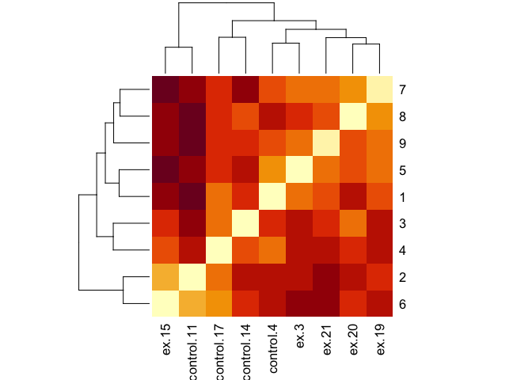<!-- -->

    ## # A tibble: 3 x 2
    ##   Label                         mean_dist
    ##   <fct>                             <dbl>
    ## 1 Between control and exclosure     0.360
    ## 2 Within control                    0.355
    ## 3 Within exclosure                  0.341

    ##             Df  Sum Sq  Mean Sq F value Pr(>F)
    ## Label        2 0.00246 0.001231    0.15  0.861
    ## Residuals   33 0.27040 0.008194

    ##   Tukey multiple comparisons of means
    ##     95% family-wise confidence level
    ## 
    ## Fit: aov(formula = Distance ~ Label, data = sum.ann.16.group_dist)
    ## 
    ## $Label
    ##                                                        diff        lwr
    ## Within control-Between control and exclosure   -0.004810298 -0.1082015
    ## Within exclosure-Between control and exclosure -0.019167352 -0.1051941
    ## Within exclosure-Within control                -0.014357054 -0.1290593
    ##                                                       upr     p adj
    ## Within control-Between control and exclosure   0.09858094 0.9928419
    ## Within exclosure-Between control and exclosure 0.06685936 0.8488524
    ## Within exclosure-Within control                0.10034522 0.9494089

#### CCA by Treatment

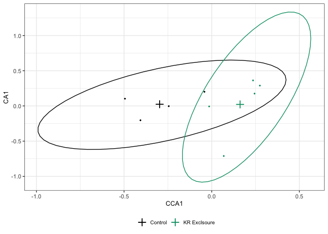<!-- -->

    ## [1] "Variance Inflation Factor (<10 is fine)"

    ## summerannuals_2016_trtexclosure 
    ##                               1

    ## [1] "Variance explained:"

    ## [1] 0.1117901

    ## Permutation test for cca under NA model
    ## Marginal effects of terms
    ## Permutation: free
    ## Number of permutations: 999
    ## 
    ## Model: cca(formula = summerannuals_2016_sp ~ summerannuals_2016_trt)
    ##                        Df ChiSquare     F Pr(>F)
    ## summerannuals_2016_trt  1   0.05687 0.881  0.617
    ## Residual                7   0.45185

### Winter Annuals 2017

#### Bray-Curtis Distances & Heatmap

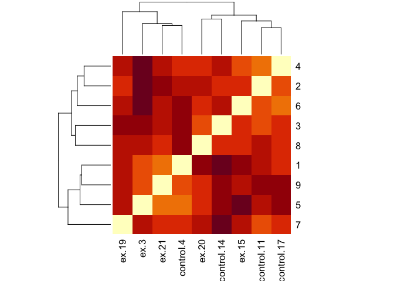<!-- -->

    ## # A tibble: 3 x 2
    ##   Label                         mean_dist
    ##   <fct>                             <dbl>
    ## 1 Between control and exclosure     0.434
    ## 2 Within control                    0.405
    ## 3 Within exclosure                  0.434

    ##             Df  Sum Sq  Mean Sq F value Pr(>F)
    ## Label        2 0.00424 0.002121   0.411  0.666
    ## Residuals   33 0.17031 0.005161

    ##   Tukey multiple comparisons of means
    ##     95% family-wise confidence level
    ## 
    ## Fit: aov(formula = Distance ~ Label, data = wint.ann.2017.group_dist)
    ## 
    ## $Label
    ##                                                         diff         lwr
    ## Within control-Between control and exclosure   -0.0291967211 -0.11125029
    ## Within exclosure-Between control and exclosure -0.0002162611 -0.06848896
    ## Within exclosure-Within control                 0.0289804600 -0.06204980
    ##                                                       upr     p adj
    ## Within control-Between control and exclosure   0.05285685 0.6607623
    ## Within exclosure-Between control and exclosure 0.06805643 0.9999667
    ## Within exclosure-Within control                0.12001072 0.7170343

#### CCA by Treatment

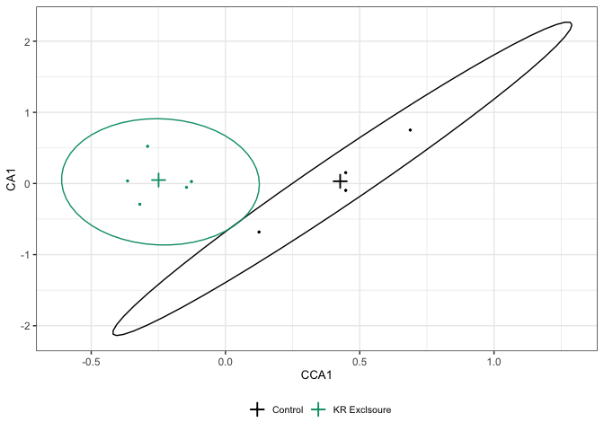<!-- -->

    ## [1] "Variance Inflation Factor (<10 is fine)"

    ## winterannuals_2017_trtexclosure 
    ##                               1

    ## [1] "Variance explained:"

    ## [1] 0.1674206

    ## Permutation test for cca under NA model
    ## Marginal effects of terms
    ## Permutation: free
    ## Number of permutations: 999
    ## 
    ## Model: cca(formula = winterannuals_2017_sp ~ winterannuals_2017_trt)
    ##                        Df ChiSquare      F Pr(>F)  
    ## winterannuals_2017_trt  1   0.11540 1.4076  0.081 .
    ## Residual                7   0.57389                
    ## ---
    ## Signif. codes:  0 '***' 0.001 '**' 0.01 '*' 0.05 '.' 0.1 ' ' 1

### Summer Annuals 2017

#### Bray-Curtis Distances & Heatmap

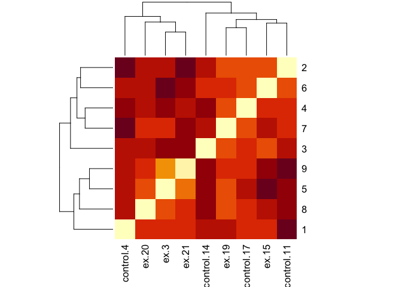<!-- -->

    ## # A tibble: 3 x 2
    ##   Label                         mean_dist
    ##   <fct>                             <dbl>
    ## 1 Between control and exclosure     0.323
    ## 2 Within control                    0.346
    ## 3 Within exclosure                  0.290

    ##             Df  Sum Sq  Mean Sq F value Pr(>F)
    ## Label        2 0.01312 0.006560   2.261   0.12
    ## Residuals   33 0.09577 0.002902

    ##   Tukey multiple comparisons of means
    ##     95% family-wise confidence level
    ## 
    ## Fit: aov(formula = Distance ~ Label, data = sum.ann.17.group_dist)
    ## 
    ## $Label
    ##                                                       diff         lwr
    ## Within control-Between control and exclosure    0.02307317 -0.03845620
    ## Within exclosure-Between control and exclosure -0.03309950 -0.08429504
    ## Within exclosure-Within control                -0.05617267 -0.12443339
    ##                                                       upr     p adj
    ## Within control-Between control and exclosure   0.08460255 0.6316014
    ## Within exclosure-Between control and exclosure 0.01809603 0.2655666
    ## Within exclosure-Within control                0.01208804 0.1233952

#### CCA by Treatment

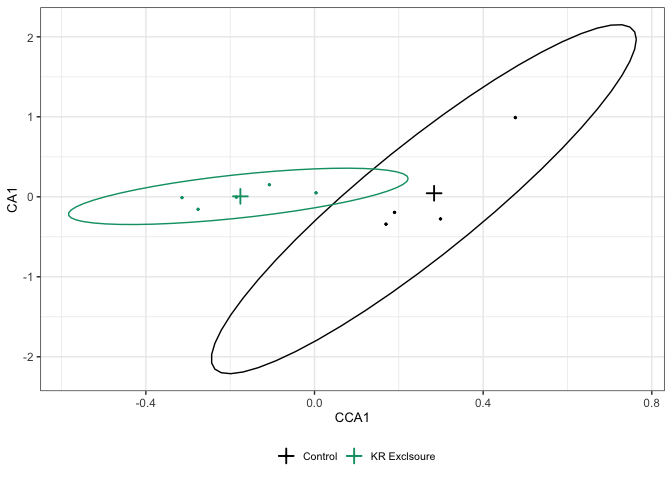<!-- -->

    ## [1] "Variance Inflation Factor (<10 is fine)"

    ## summerannuals_2017_trtexclosure 
    ##                               1

    ## [1] "Variance explained:"

    ## [1] 0.1090373

    ## Permutation test for cca under NA model
    ## Marginal effects of terms
    ## Permutation: free
    ## Number of permutations: 999
    ## 
    ## Model: cca(formula = summerannuals_2017_sp ~ summerannuals_2017_trt)
    ##                        Df ChiSquare      F Pr(>F)
    ## summerannuals_2017_trt  1   0.05155 0.8567  0.701
    ## Residual                7   0.42123

## All Plants by Sampling Period and Treatment

### Summer All Plants 2016

#### Bray-Curtis Distances & Heatmap

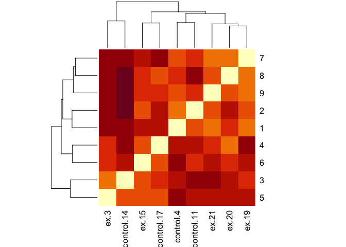<!-- -->

    ## # A tibble: 3 x 2
    ##   Label                         mean_dist
    ##   <fct>                             <dbl>
    ## 1 Between control and exclosure     0.401
    ## 2 Within control                    0.406
    ## 3 Within exclosure                  0.362

    ##             Df Sum Sq  Mean Sq F value Pr(>F)
    ## Label        2 0.0116 0.005802   0.987  0.383
    ## Residuals   33 0.1939 0.005876

    ##   Tukey multiple comparisons of means
    ##     95% family-wise confidence level
    ## 
    ## Fit: aov(formula = Distance ~ Label, data = sum.all.16.group_dist)
    ## 
    ## $Label
    ##                                                        diff         lwr
    ## Within control-Between control and exclosure    0.005429066 -0.08212476
    ## Within exclosure-Between control and exclosure -0.038595862 -0.11144505
    ## Within exclosure-Within control                -0.044024928 -0.14115718
    ##                                                       upr     p adj
    ## Within control-Between control and exclosure   0.09298289 0.9873226
    ## Within exclosure-Between control and exclosure 0.03425332 0.4052139
    ## Within exclosure-Within control                0.05310732 0.5134890

#### CCA by Treatment

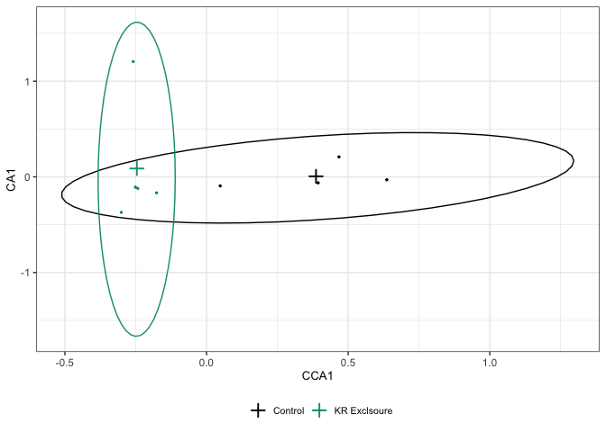<!-- -->

    ## [1] "Variance Inflation Factor (<10 is fine)"

    ## summer_2016_trtexclosure 
    ##                        1

    ## [1] "Variance explained:"

    ## [1] 0.1326964

    ## Permutation test for cca under NA model
    ## Marginal effects of terms
    ## Permutation: free
    ## Number of permutations: 999
    ## 
    ## Model: cca(formula = summer_2016_sp ~ summer_2016_trt)
    ##                 Df ChiSquare     F Pr(>F)
    ## summer_2016_trt  1   0.10162 1.071  0.328
    ## Residual         7   0.66418

### Winter All Plants 2017

#### Bray-Curtis Distances & Heatmap

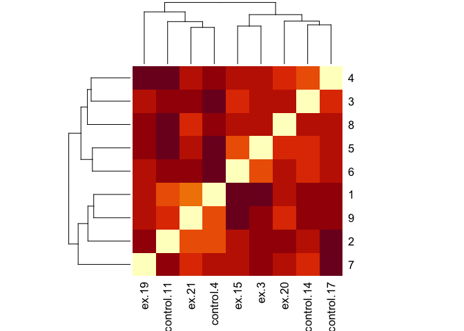<!-- -->

    ## # A tibble: 3 x 2
    ##   Label                         mean_dist
    ##   <fct>                             <dbl>
    ## 1 Between control and exclosure     0.478
    ## 2 Within control                    0.467
    ## 3 Within exclosure                  0.457

    ##             Df  Sum Sq  Mean Sq F value Pr(>F)
    ## Label        2 0.00307 0.001534   0.341  0.714
    ## Residuals   33 0.14859 0.004503

    ##   Tukey multiple comparisons of means
    ##     95% family-wise confidence level
    ## 
    ## Fit: aov(formula = Distance ~ Label, data = wint.all.17.group_dist)
    ## 
    ## $Label
    ##                                                       diff         lwr
    ## Within control-Between control and exclosure   -0.01097416 -0.08761727
    ## Within exclosure-Between control and exclosure -0.02118097 -0.08495189
    ## Within exclosure-Within control                -0.01020681 -0.09523471
    ##                                                       upr     p adj
    ## Within control-Between control and exclosure   0.06566896 0.9343539
    ## Within exclosure-Between control and exclosure 0.04258996 0.6964978
    ## Within exclosure-Within control                0.07482109 0.9533660

#### CCA by Treatment

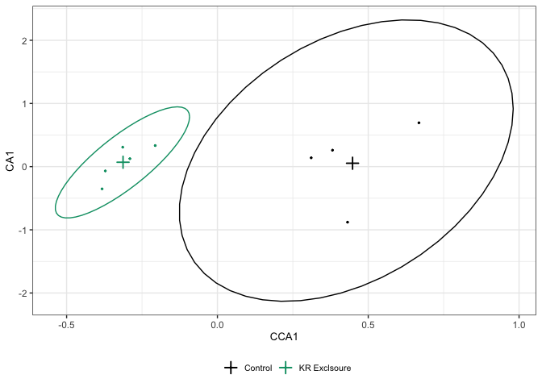<!-- -->

    ## [1] "Variance Inflation Factor (<10 is fine)"

    ## winter_2017_trtexclosure 
    ##                        1

    ## [1] "Variance explained:"

    ## [1] 0.1477049

    ## Permutation test for cca under NA model
    ## Marginal effects of terms
    ## Permutation: free
    ## Number of permutations: 999
    ## 
    ## Model: cca(formula = winter_2017_sp ~ winter_2017_trt)
    ##                 Df ChiSquare      F Pr(>F)
    ## winter_2017_trt  1   0.14903 1.2131  0.146
    ## Residual         7   0.85992

### Summer All Plants 2017

#### Bray-Curtis Distances & Heatmap

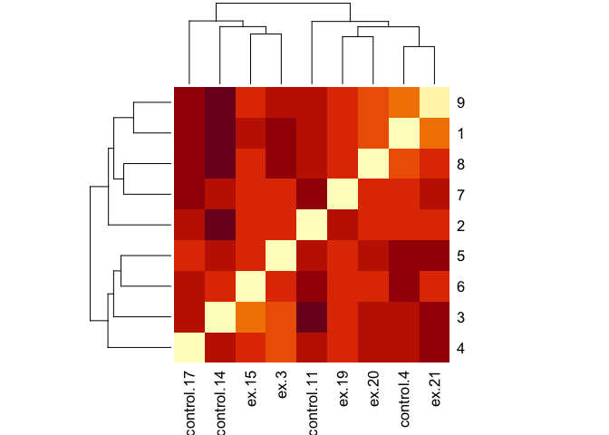<!-- -->

    ## # A tibble: 3 x 2
    ##   Label                         mean_dist
    ##   <fct>                             <dbl>
    ## 1 Between control and exclosure     0.345
    ## 2 Within control                    0.362
    ## 3 Within exclosure                  0.306

    ##             Df  Sum Sq  Mean Sq F value Pr(>F)  
    ## Label        2 0.01463 0.007315   3.119 0.0575 .
    ## Residuals   33 0.07740 0.002345                 
    ## ---
    ## Signif. codes:  0 '***' 0.001 '**' 0.01 '*' 0.05 '.' 0.1 ' ' 1

    ##   Tukey multiple comparisons of means
    ##     95% family-wise confidence level
    ## 
    ## Fit: aov(formula = Distance ~ Label, data = sum.all.17.group_dist)
    ## 
    ## $Label
    ##                                                       diff         lwr
    ## Within control-Between control and exclosure    0.01712198 -0.03819242
    ## Within exclosure-Between control and exclosure -0.03892331 -0.08494768
    ## Within exclosure-Within control                -0.05604529 -0.11741111
    ##                                                        upr     p adj
    ## Within control-Between control and exclosure   0.072436377 0.7300463
    ## Within exclosure-Between control and exclosure 0.007101048 0.1106206
    ## Within exclosure-Within control                0.005320525 0.0790080

#### CCA by Treatment

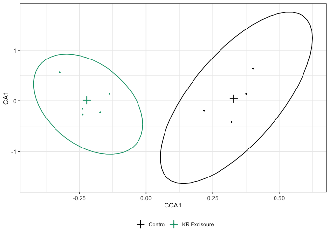<!-- -->

    ## [1] "Variance Inflation Factor (<10 is fine)"

    ## summer_2017_trtexclosure 
    ##                        1

    ## [1] "Variance explained:"

    ## [1] 0.1229296

    ## Permutation test for cca under NA model
    ## Marginal effects of terms
    ## Permutation: free
    ## Number of permutations: 999
    ## 
    ## Model: cca(formula = summer_2017_sp ~ summer_2017_trt)
    ##                 Df ChiSquare      F Pr(>F)
    ## summer_2017_trt  1   0.07275 0.9811  0.536
    ## Residual         7   0.51907
