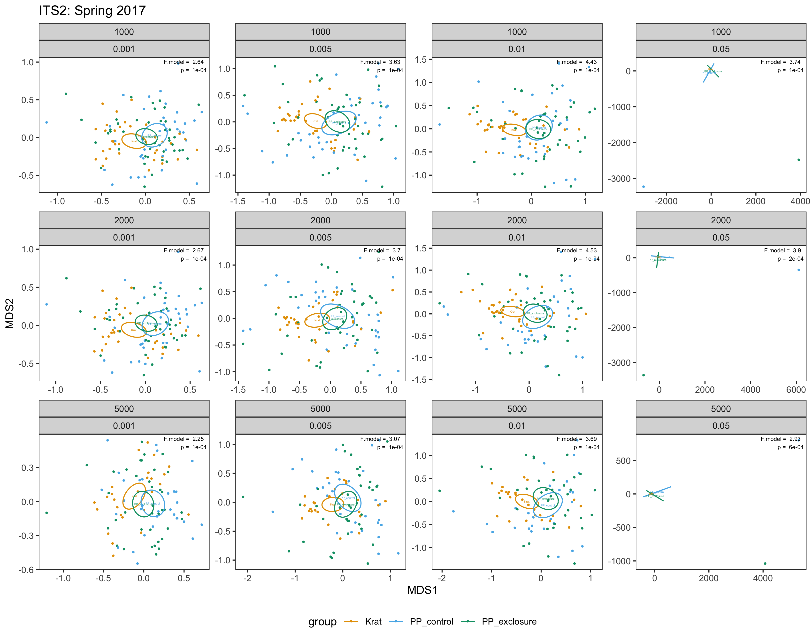
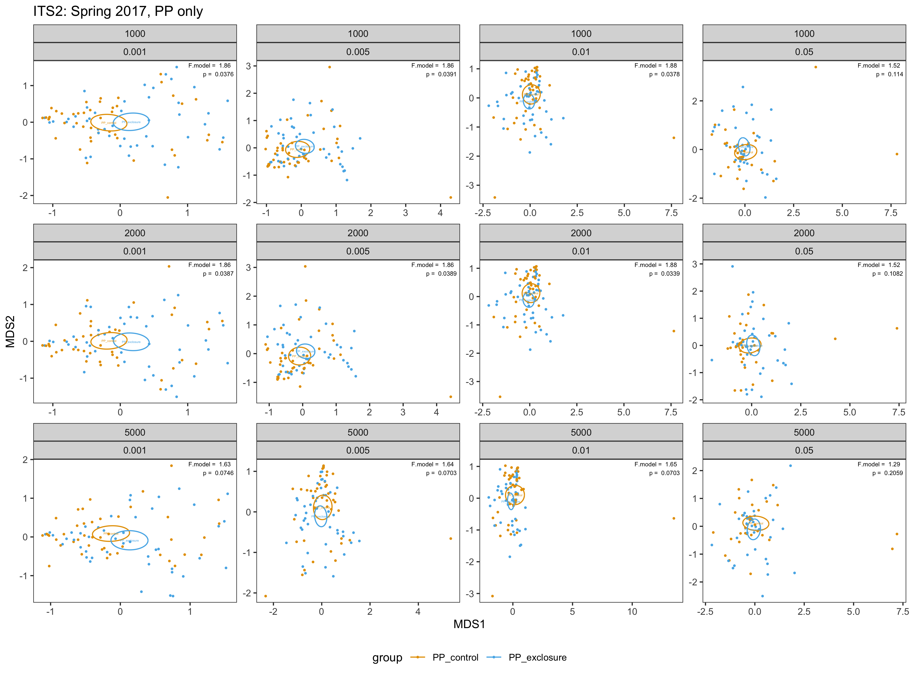
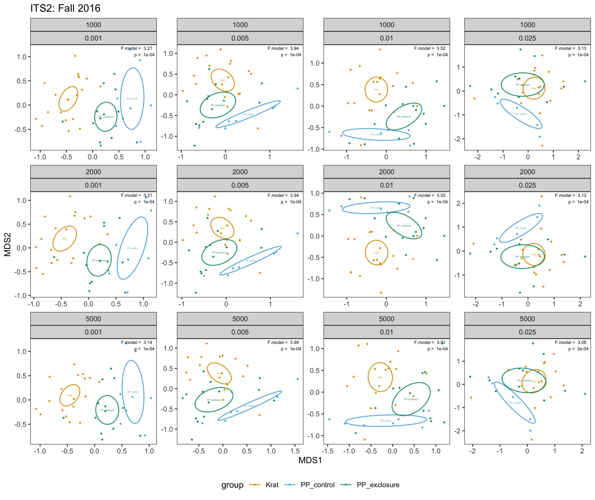
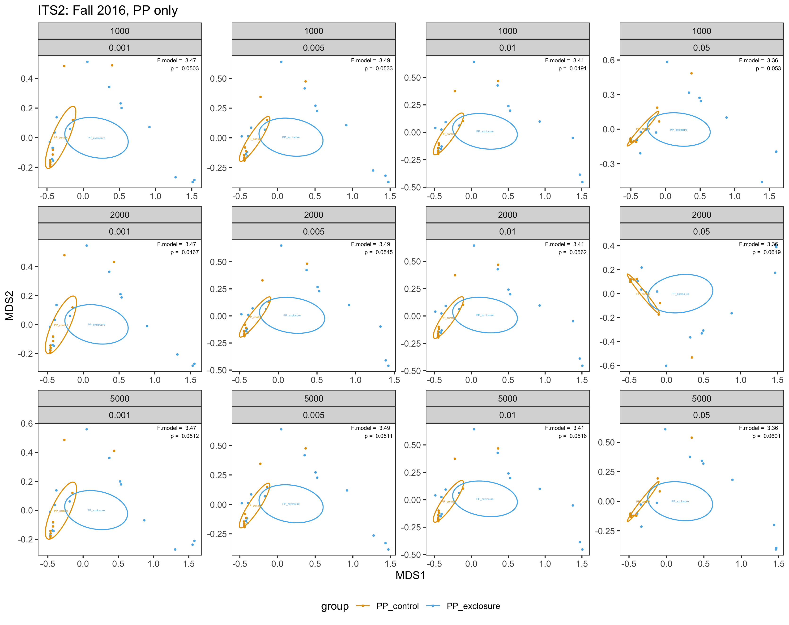

```{r setup, include=FALSE}
library(knitr)
knitr::opts_chunk$set(echo = FALSE)
```

## Using OTUs

### Plot 1
* 2017 data
* binary (presence/absence)
* all potential millet removed

```{r figure1}

```

### Plot 2
* 2017 data
* PP only = proportions
* all potential millet removed

```{r figure2}

```

### Plot 3
* 2016 data
* binary (presence/absence)
* all potential millet removed

```{r figure3}

```

### Plot 4
* 2016 data
* PP only = proportions
* all potential millet removed

```{r figure4}

```
