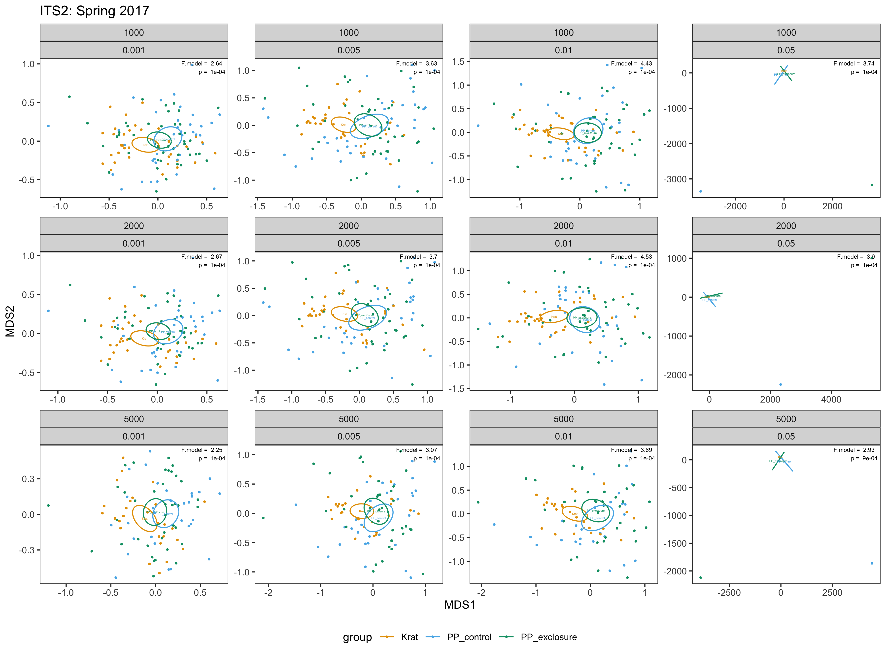
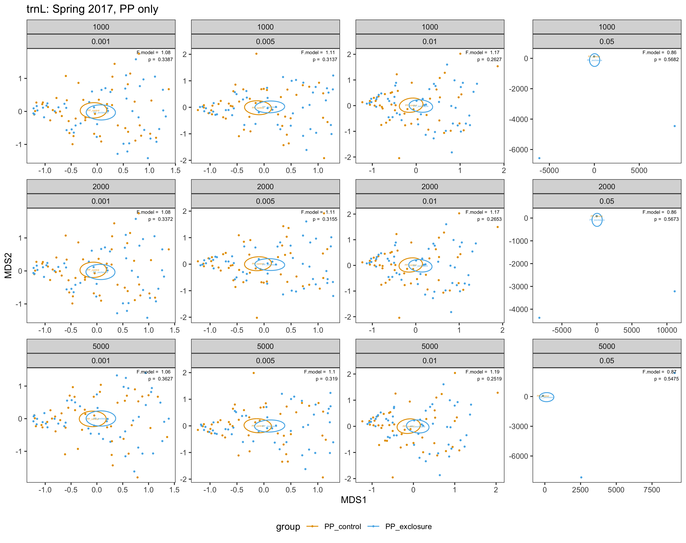
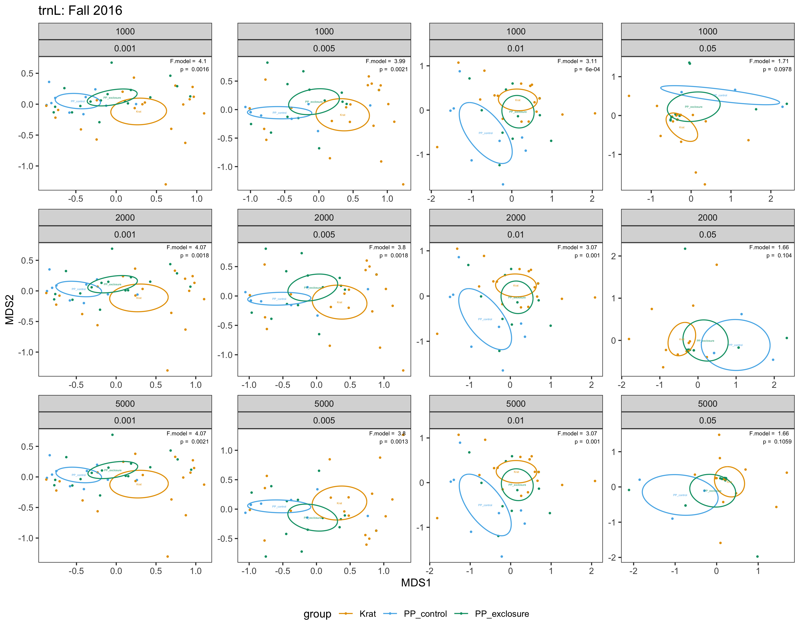
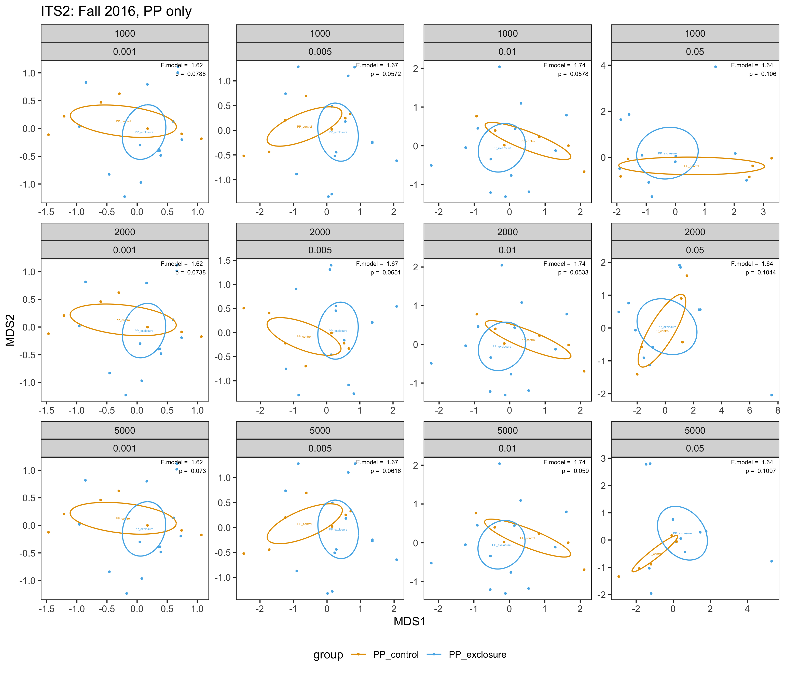
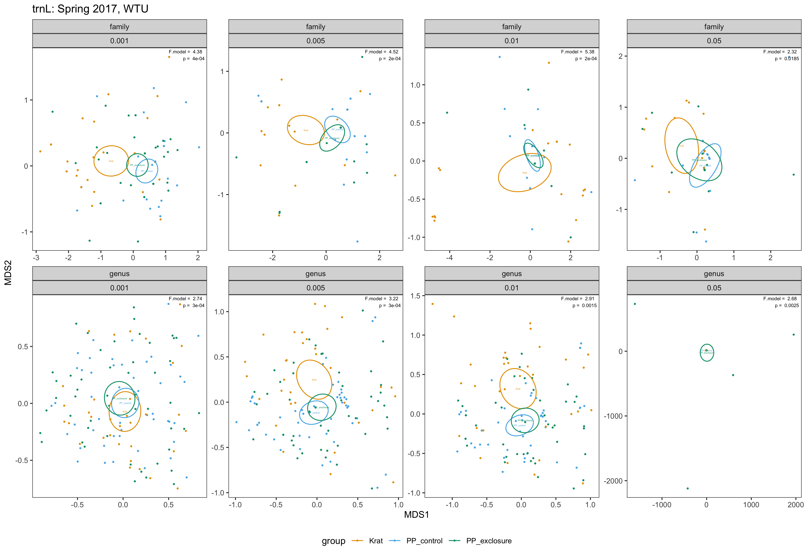
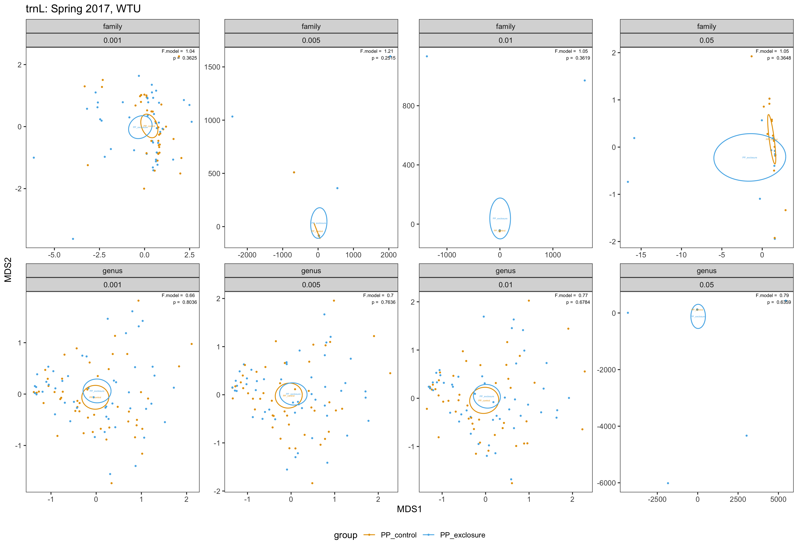
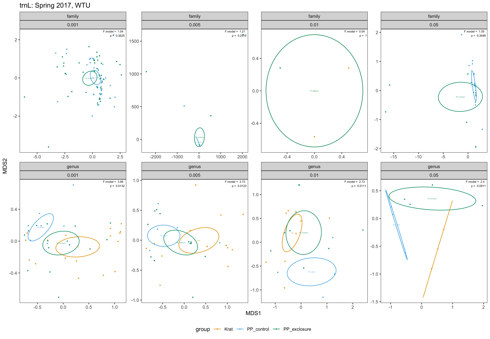
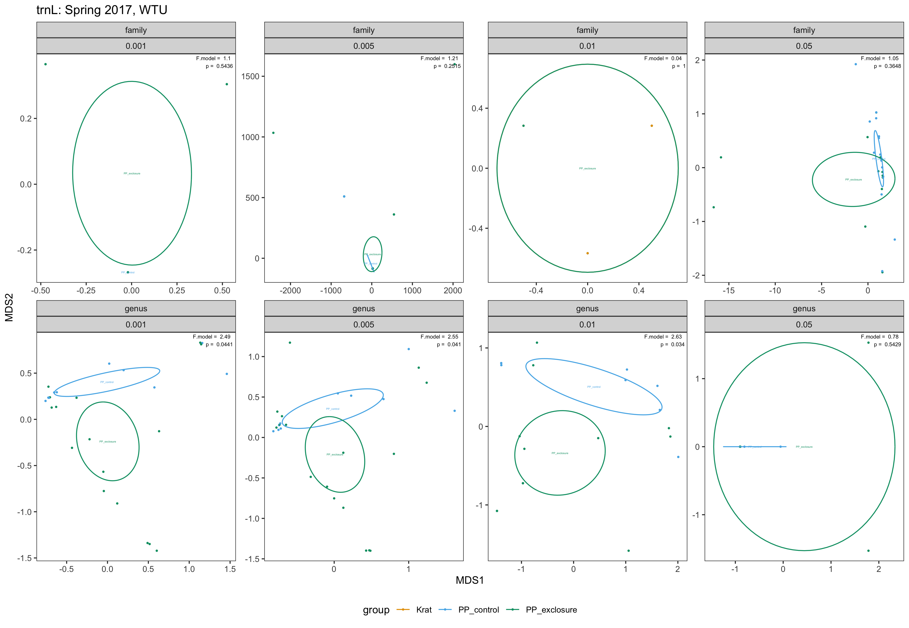

NMDS Plotting: trnL
================
Ellen Bledsoe
21 July, 2020

## Using OTUs

### Plot 1

  - 2017 data
  - binary (presence/absence)
  - all potential millet removed

<!-- -->

### Plot 2

  - 2017 data
  - PP only = proportions
  - all potential millet removed

<!-- -->

### Plot 3

  - 2016 data
  - binary (presence/absence)
  - all potential millet removed

<!-- -->

### Plot 4

  - 2016 data
  - PP only = proportions
  - all potential millet removed

<!-- -->

## Using WeeTUs

### Plot 1

  - 2017 data
  - all species
  - all potential millet removed
  - minimum total reads = 2000

<!-- -->

### Plot 2

  - 2017 data
  - PP only = proportions
  - all potential millet removed
  - minimum total reads = 2000

<!-- -->

### Plot 3

  - 2016 data
  - all species
  - all potential millet removed
  - minimum total reads = 2000

<!-- -->

### Plot 4

  - 2016 data
  - PP only = proportions
  - all potential millet removed
  - minimum total reads = 2000

<!-- -->
