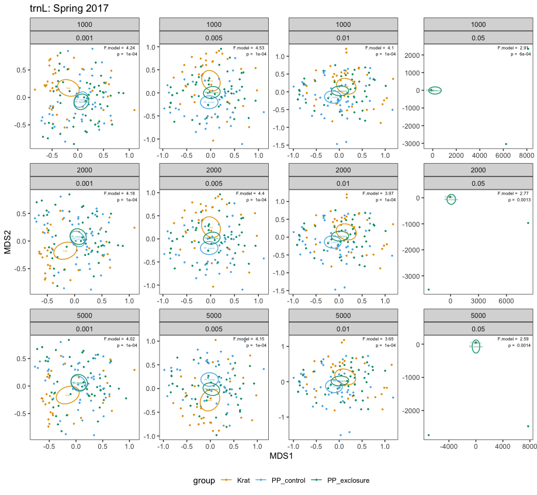
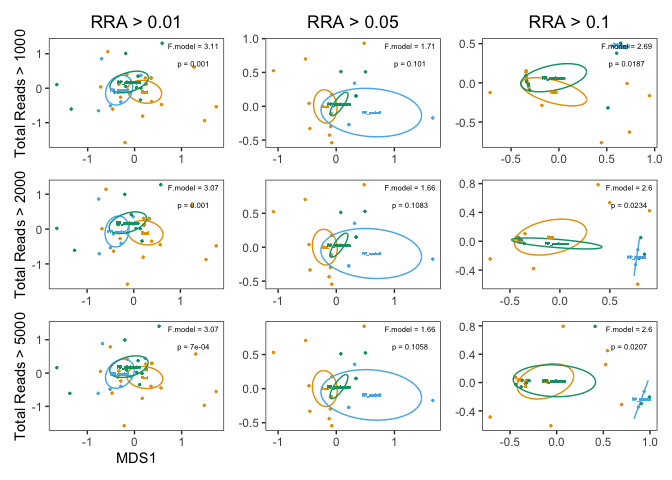
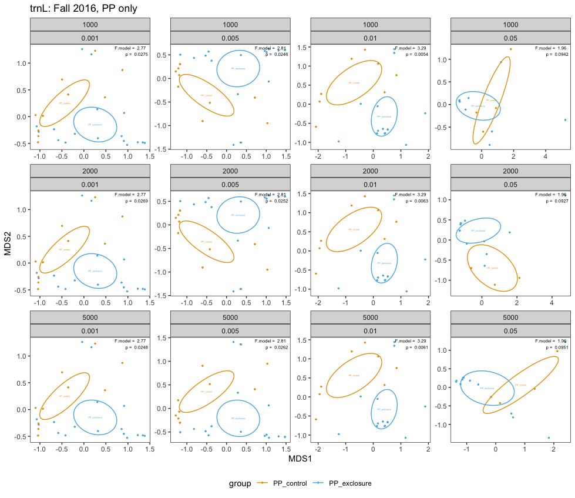
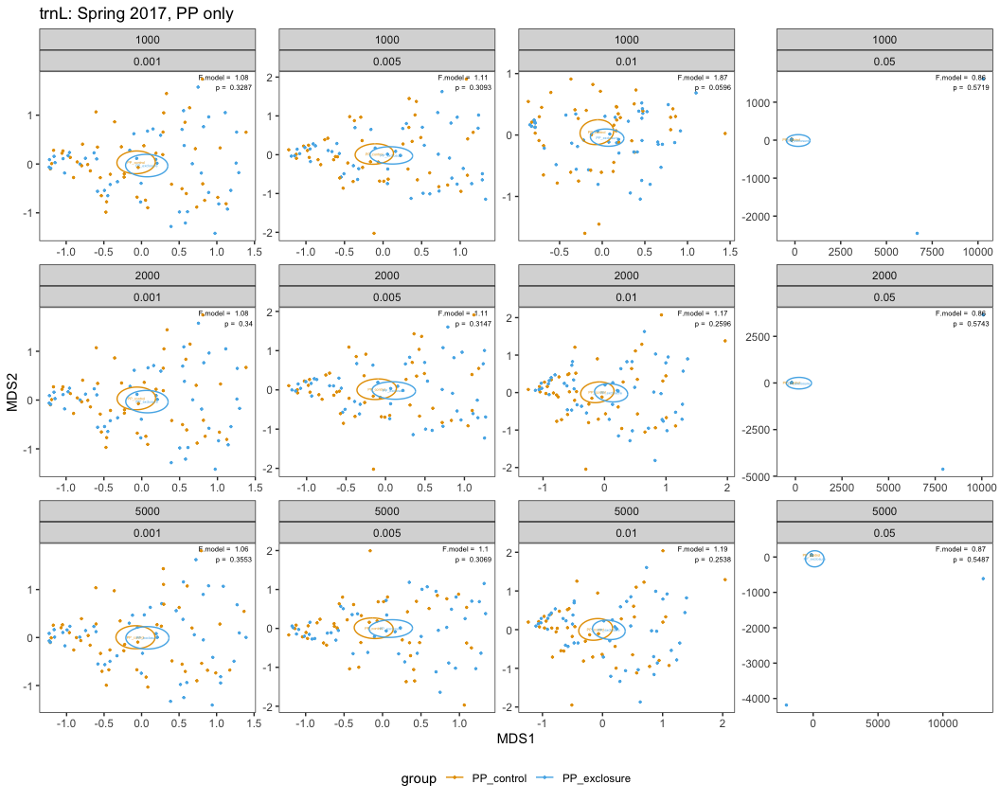

NMDS Plotting: trnL
================
Ellen Bledsoe
18 June, 2020

## Plot 1

  - 2017 data
  - binary (presence/absence)
  - trnL
  - all potential millet
removed

## Plot 2

  - 2016 data
  - binary (presence/absence)
  - trnL
  - all potential millet
removed

## Plot 3

  - 2016 data
  - PP only = proportions
  - trnL
  - all potential millet
removed

## Plot 4

  - 2017 data
  - PP only = proportions
  - trnL
  - all potential millet removed
    
